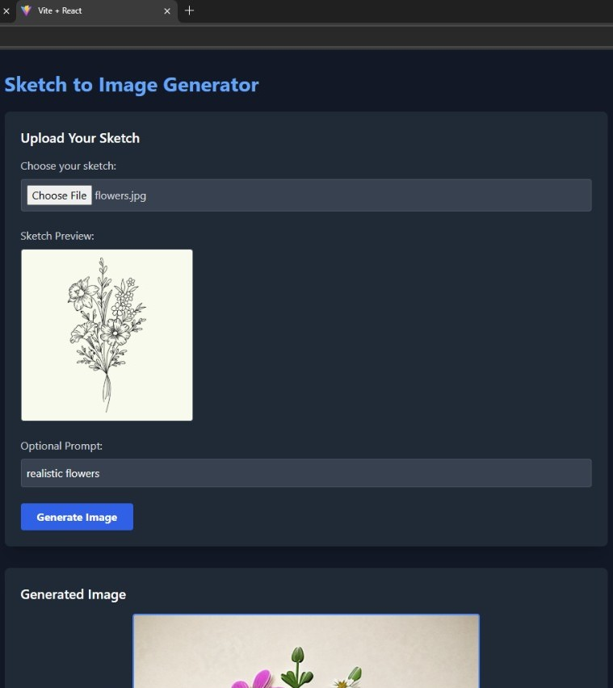
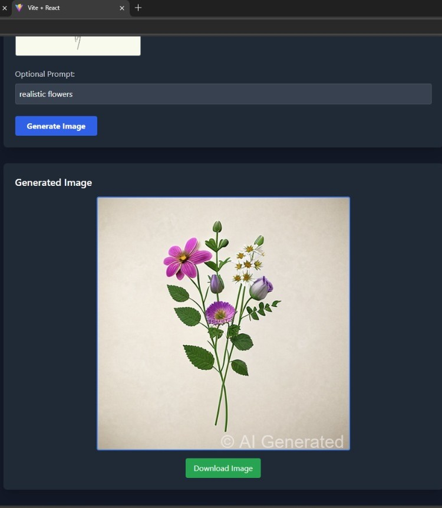
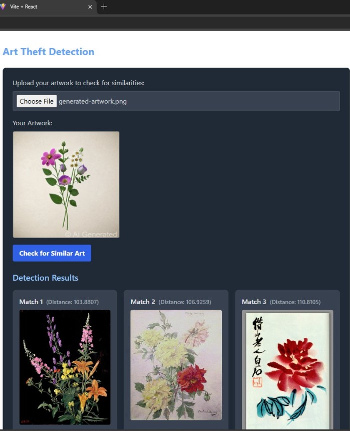
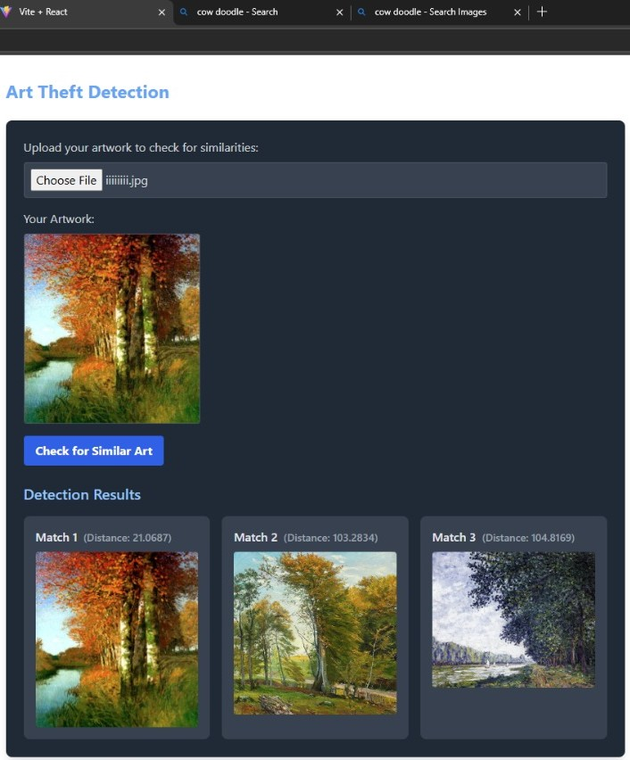

# 🖌️ Inkuity – Sketch to Realistic Image Generation & Art Theft Detection

## 🎨 Overview  
**Inkuity** is a web platform designed for artists to transform their hand-drawn sketches into realistic AI-generated images and to detect potential art theft.  
It integrates **Stable Diffusion with ControlNet** for sketch-to-image generation and uses **ResNet50 with FAISS** for similarity-based art theft detection.

---

## 🚀 Features
- ✏️ **Sketch to Realistic Image Generation** using **Stable Diffusion + ControlNet**
- 🔍 **Art Theft Detection** with **ResNet50 feature extraction** and **FAISS cosine similarity search**
- 🖼️ **Real-time Sketch Preview** and **Prompt-based Generation**
- 💧 **Watermarking** for ownership and originality tracking
- ⚡ **FastAPI Backend** for efficient model inference and endpoints
- 🌐 **Responsive React Frontend** styled with **Tailwind CSS**
- ☁️ **MongoDB / S3 Integration** for metadata and image storage

---

## 🧩 Tech Stack

### **Frontend**
- **React.js** – for modular, interactive UI  
- **Tailwind CSS** – for utility-first, responsive styling  

### **Backend**
- **FastAPI** – for lightweight, high-performance REST APIs  

### **Machine Learning & Image Processing**
- **Stable Diffusion + ControlNet** – for sketch-to-image generation  
- **ResNet50** – for feature extraction in art theft detection  
- **FAISS (Facebook AI Similarity Search)** – for fast similarity queries  
- **PyTorch** – for model training and inference  
- **OpenCV** – for image preprocessing (resizing, grayscale, edge detection)

---

## 🏗️ Architecture Overview  

The system follows a **microservices-based architecture**:

1. **Frontend (React)** – handles sketch uploads, real-time previews, and user prompts.  
2. **Backend (FastAPI)** – processes API requests and routes data to ML modules.  
3. **Sketch-to-Image Service** – runs Stable Diffusion + ControlNet to generate images.  
4. **Art Theft Detection Module** – extracts ResNet50 embeddings, stores them in FAISS, and compares new uploads for similarity.  

---

## 💻 Hardware & Software Requirements

| Component | Recommended Specification |
|------------|----------------------------|
| **CPU** | Intel i5 / Ryzen 5 or higher |
| **RAM** | Minimum 8GB (16GB+ preferred) |
| **GPU** | NVIDIA GTX 1060+ (CUDA-enabled) |
| **Storage** | 100GB SSD or more |
| **OS** | Windows / Linux / macOS |
| **Dependencies** | Python ≥3.8, Node.js ≥16 |

---

## 📸 Results

### 🖌️ Doodle to Realistic Image Generation  
Using **Stable Diffusion and ControlNet**

| Sketch | Generated Image |
|--------|-----------------|
|  |  |

---

### 🔍 Art Theft Detection  
Detects visually similar artworks using **FAISS cosine similarity**

#Example 1

#Example 2

---

## 🧾 License  
This project is released under the **MIT License**.

---

## ✨ Contributors  
- **[Drupitha Chandrashekar]** – Developer & Researcher
- **[Chandana N C]** – Developer & Researcher
- **[Keerthana S]** – Developer & Researcher
- **[Monica D]** – Developer & Researcher

